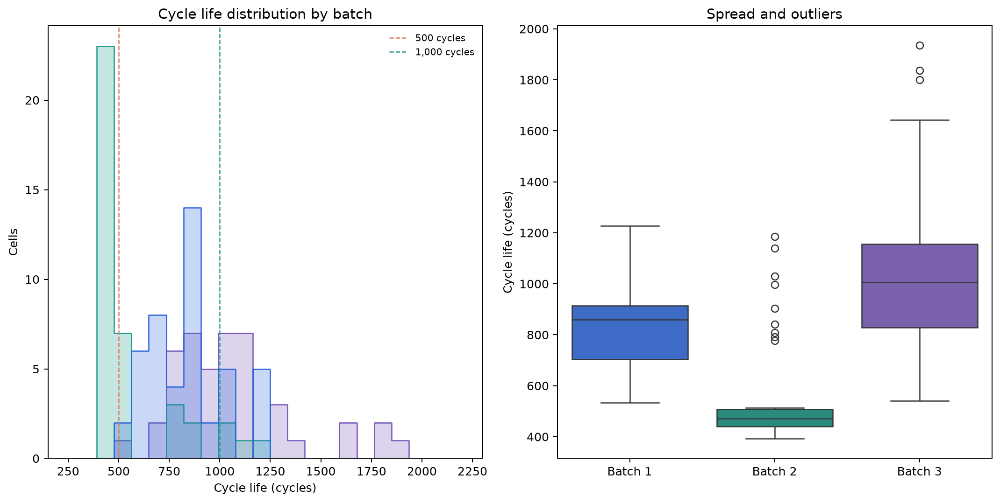
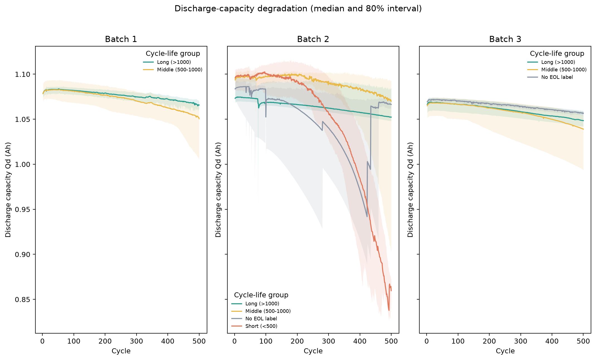
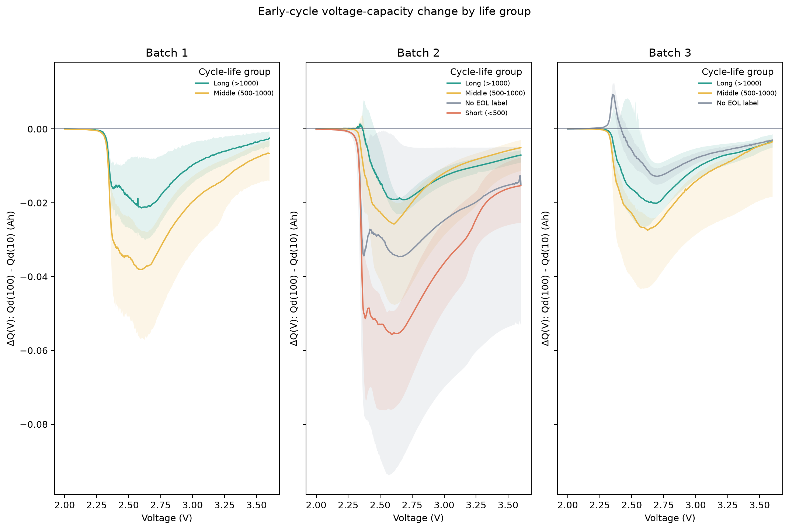
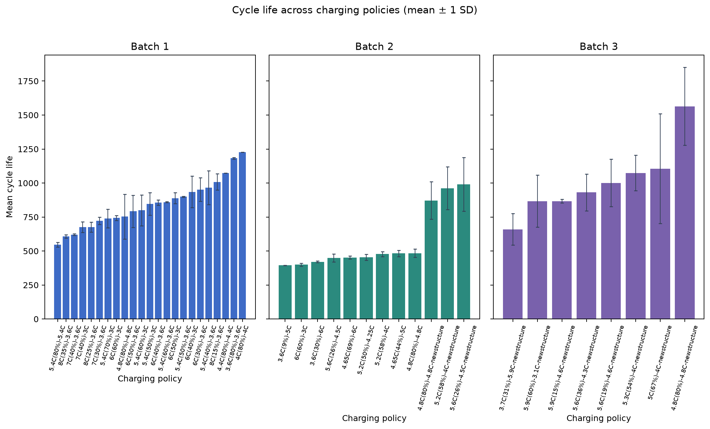
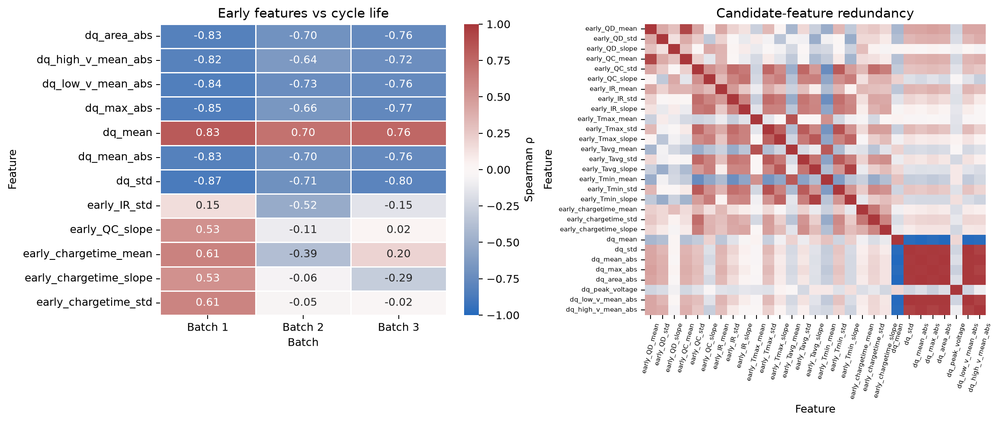

# ESS Health: 배터리 수명 분석 및 예측

SKALA 데이터 분석 Mini-Project · 울산캠퍼스 3반 · 강도희

## 프로젝트 목표

초기 100 cycle의 충전·방전 신호와 `cycle_life`를 분석하고, 초기 데이터만으로 배터리 수명을 예측하는 회귀 모델을 설계했다. Batch 1으로 학습하고 Batch 2를 최종 테스트했으며, 선택한 모델을 Batch 3에도 추가 평가했다.

## 데이터와 품질

세 배치에 셀 139개가 있다. `cycle_life` label은 129개이며, Batch 2의 8개와 Batch 3의 2개는 label이 없다. 결측 수명은 대체하지 않았다. 수명 분포와 지도학습 지표에서는 제외하고, label이 필요하지 않은 용량 곡선 탐색에는 사용했다.

| 배치 | 셀 | 유효 label | 평균 cycle life | 중앙값 | 범위 | `<500` | `>1,000` |
|---|---:|---:|---:|---:|---:|---:|---:|
| Batch 1 | 46 | 46 | 844.7 | 858.5 | 534–1,227 | 0 | 10 |
| Batch 2 | 47 | 39 | 565.7 | 472.0 | 392–1,186 | 28 | 3 |
| Batch 3 | 46 | 44 | 1,059.7 | 1,005.5 | 541–1,935 | 0 | 23 |

Batch 2 label 중 28/39개가 500 cycle 미만이며 중앙값은 Batch 1보다 386.5 cycle 낮다. 이 차이는 배치 간 분포 이동으로 보고, 단일 충전 속도의 인과 효과로 해석하지 않았다.

## EDA 핵심 결과

### Cycle Life와 단수명 셀

단수명 label은 Batch 2에 집중됐다. 가장 짧은 셀은 Batch 1에서 534 cycle (`5.4C(80%)-5.4C`), Batch 2에서 392 cycle (`6C(60%)-3C`), Batch 3에서 541 cycle (`3.7C(31%)-5.9C-newstructure`)이다. Batch 2의 최저 셀 두 개는 서로 다른 프로토콜을 사용하고 있어, 프로토콜 하나만으로 단수명을 설명하기 어렵다.

### 방전 용량 열화와 knee 후보

cycle 100에서 500까지 배치별 중앙 Qd 변화는 Batch 1 −2.30%, Batch 2 −3.84%, Batch 3 −2.00%였다. 15-cycle 중앙값 smoothing 후 열화 가속이 가장 큰 지점은 Batch 1 479, Batch 2 492, Batch 3 361 cycle로 탐색됐다. knee 후보는 탐색값이며 전환점으로 확정하지 않았다.

원자료의 Qd 중 1.3 Ah 초과 측정값 13건(10개 셀)은 정상 곡선과 크게 달라 곡선 및 knee 요약에서 제외했다. 원자료와 추출 CSV에는 그대로 남아 있다.

### 초기 ΔQ(V)

`ΔQ(V) = Qdlin(100 cycle) − Qdlin(10 cycle)`로 곡선을 만들고 평균 절대값, 표준편차, 절대 면적, 전압 구간별 평균, 피크 전압 등의 통계량을 추출했다. 배치별 cycle life와 가장 강하게 연관된 ΔQ 통계량은 `|Spearman ρ|` 0.73–0.87 범위였다. ΔQ 피처끼리도 높은 상관을 보여 모델 안에서 피처 선택과 Ridge 규제를 적용했다.

### 충전 조건과 열화 속도

C1과 cycle life의 Spearman 상관은 Batch 1 −0.483, Batch 2 +0.055, Batch 3 −0.229였다. C1과 첫 100 cycle의 Qd 기울기 상관도 Batch 1 −0.380, Batch 2 −0.187, Batch 3 −0.068로 달라 공통적인 고속 충전 효과를 단정할 수 없다. 충전 프로토콜별 평균 수명은 배치별로 비교했으며, 표본 구성 차이를 통제하지 않은 관찰 결과로 해석했다.

### 초기 피처와 다중공선성

첫 100 cycle의 Qd, QC, IR, 온도, 충전시간 요약값과 ΔQ 통계량을 비교했다. 강한 상관을 보이는 ΔQ 통계량이 서로 중복될 수 있어 상관행렬로 피처 간 중복을 확인했다. 배치별 상관 차이가 있어 특정 피처의 단변량 상관만으로 일반화하지 않았다.

## 모델과 평가 설계

- **예측 과제:** 연속형 `cycle_life` 회귀. 초기 100 cycle 신호로 EOL까지의 cycle 수를 예측한다.
- **후보:** 중앙값 Dummy 회귀 기준선, Ridge, 얕은 Random Forest. CV MAPE로 Ridge(`alpha=0.1`)를 선택했다.
- **피처:** CV pipeline 안에서 결측값 대체, `SelectKBest`, 표준화 후 모델을 fit한다. 최종 Ridge가 선택한 피처 8개는 충전시간 평균과 ΔQ 통계량이다.
- **분할:** Batch 1 유효 label 46개를 충전 프로토콜 그룹 기준 35개 학습 부분과 11개 hold-out으로 나눴다. 학습 부분에는 GroupKFold를 사용해 같은 프로토콜이 fold 양쪽에 나뉘지 않도록 했다. 후보 선택 후 Batch 1 전체로 재학습하고 Batch 2에서 최종 평가했다. Batch 3은 추가 평가다.
- **재현성:** `random_state=42`; 전처리와 피처 선택은 CV pipeline 내부에서 학습한다.

### MAPE 평가

| 구간 | 중앙값 Dummy | Ridge |
|---|---:|---:|
| Batch 1 Train CV 평균 | 19.63% | 7.59% ± 1.06% |
| Batch 1 Hold-out Valid | 16.49% | 10.50% |
| Batch 2 Test | 72.66% | 25.96% |
| Batch 3 추가 평가 | 20.20% | 14.39% |

Batch 2 Ridge의 보조 지표는 MAE 131.3 cycle, RMSE 145.5 cycle, R² 0.56이다. 수업에서 제시한 원논문 MAPE 기준 9.1%에 비해 Batch 2 MAPE가 16.86 percentage point 높아 기준을 충족하지 못했다.

| MAPE 차이 | 결과 |
|---|---:|
| Valid − Train CV | +2.91 percentage point |
| Batch 2 Test − Valid | +15.46 percentage point |
| Batch 2 Test − 논문 기준 9.1% | +16.86 percentage point |

Batch 2와 Batch 1의 Cycle Life 분포 차이와 프로토콜 구성이 커서 hold-out 성능보다 Batch 2 성능이 낮았다. Batch 3 성능은 Batch 2보다 높았지만, 세 배치 사이의 이질성이 확인되어 외부 일반화 성능으로 단정하지 않는다.

## 결과 그림

### 배치별 Cycle Life 분포



### Qd 열화 곡선



### 초기 ΔQ(V)



### 충전 프로토콜과 수명



### 초기 피처 상관과 중복



## 재현 방법

저장소에는 원자료 `.mat` 파일을 넣지 않았다. 아래 세 파일을 [공개 Kaggle 데이터셋](https://www.kaggle.com/datasets/itshpark/data-driven-prediction-of-battery-cycle) 또는 원 데이터 프로젝트에서 받아 `data/raw/`에 둔다.

- `2017-05-12_batchdata_updated_struct_errorcorrect.mat`
- `2018-02-20_batchdata_updated_struct_errorcorrect.mat`
- `2018-04-12_batchdata_updated_struct_errorcorrect.mat`

```bash
python -m venv .venv
source .venv/bin/activate
pip install -r requirements.txt
python src/analysis.py
python src/model.py
python src/make_day1_pdf.py
```

분석 스크립트는 `outputs/eda/`에 배치 비교표와 그림을 만들고, 모델 스크립트는 `outputs/model/`에 MAPE/MAE/RMSE/R², gap, 셀별 예측을 저장한다. 최종 Day 1 제출 PDF는 `output/pdf/DS-MINI-Design-울산캠퍼스_3반-강도희.pdf`이다.

## 한계

- 셀 수가 적고 배치별 수명 분포와 충전 프로토콜 구성이 다르다.
- Batch 2의 8개와 Batch 3의 2개 수명 label은 결측이라 지도학습 평가에 쓸 수 없다.
- 충전 프로토콜과 수명 사이의 연관성은 관찰 결과이며 인과 효과가 아니다.
- Batch 2의 MAPE 25.96%는 원논문의 9.1% 목표보다 높다. 해당 차이를 숨기지 않고 보고했다.

## 출처

- Severson et al., [Data-driven prediction of battery cycle life before capacity degradation](https://doi.org/10.1038/s41560-019-0356-8), *Nature Energy* (2019).
- 공개 데이터 파일: [Kaggle dataset mirror](https://www.kaggle.com/datasets/itshpark/data-driven-prediction-of-battery-cycle) · [MATR original project](https://data.matr.io/1/projects/5c48dd2bc625d700019f3204).
